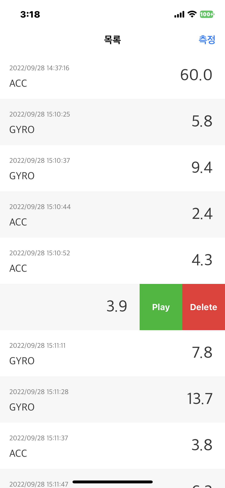
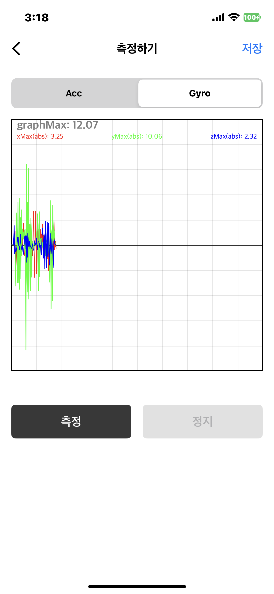
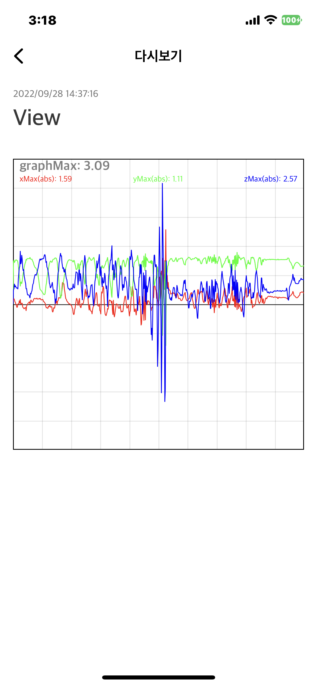
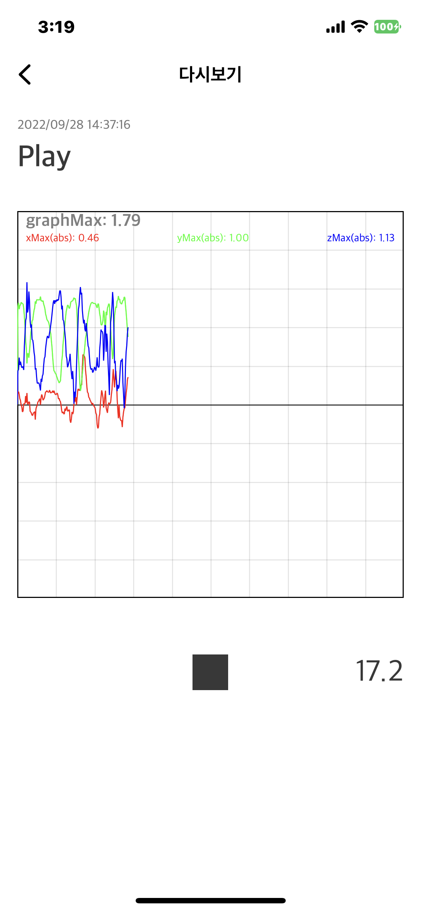

# README
# Gyro Test App

## 팀원
<table>
    <tr align="center">
        <td><B>한경수<B></td>
        <td><B>김승찬<B></td>
        <td><B>지준영<B></td>
    </tr>
    <tr align="center">
        <td width= 170px>
            
             
            <a href="https://github.com/Eric-HanGyeongSoo"><I>Eric (Eric)</I></a>
        </td>
        <td width= 170px>
            
             
            <a href="https://github.com/seungchann"><I>Channy(Channy)</I></a>
        </td>
        <td width= 170px>
            
             
            <a href="https://github.com/gelb2"><I>JunYoungJee (Bill)</I></a>
        </td>
    </tr>
</table>

# 기본구조

## MVVM

- MVVM 패턴
- UIViewController에서 작성할 수 있는 UITableView, UIButton 등 UI컴포넌트 관련 로직을 최대한 타 클래스로 이관
- 모델, 뷰모델, 뷰 간에 일어날 수 있는 데이터의 흐름, 사용자 입력 이벤트의 전달은 클로저를 통해 처리
    
    ### Model
    
    - 비즈니스 로직
    - Repostiory를 통해 DataBase 관련 클래스와 상호작용
    - ViewModel의 초기화, ViewModel과의 참조 관계 설정
    - 초기화 시 Repository를 주입 받음
    
    ### ViewModel
    
    - Model이 처리하기에 작은, View의 특성과 연관된 로직 처리
    - Model에서 받은 데이터의 가공
    - View에 필요한 데이터 전달
    - View의 이벤트 수신. 필요시 Model로 전파
    - 초기화 시 Repository를 주입 받지 않음
    
    ### View
    
    - UITableView, UIButton등 UI컴포넌트를 add한 뷰
    - UITableViewDelegate, DataSource 역할을 겸함
    - UIButton Action 등 사용자 입력 이벤트를 수신
    - 사용자 입력 이벤트, 입력값 등 별도 처리가 필요한 사항은 ViewModel로 전달
    - 필요시 2개 이상의 View를 ViewController에 addSubView할 수 있음
    - 초기화 시 ViewModel을 주입 받음

## Repository

- Model 클래스 생성 시 기본적으로 주입하는 클래스
- CoreDataManager, FileManager와의 참조 관계
- UnitTest 추가 시 MockRepository의 구현을 용이하게 하고자 RepositoryProtocol을 채택
- CoreDataManager와 같은 클래스를 직접 Model, ViewModel에 주입하는 대신 Repository에 넣는 것은 과제가 실전 상황이라고 가정했을 시 Repository가 DataBase관련 클래스를 관리하는 구조가 더 용이할 것으로 판단했기 때문임.
- ViewModel은 생성 시 Repository를 주입받지 않음. ViewModel은 연계된 특정한 View에 특화된 로직처리, 사용자의 입력 이벤트 송수신과 같은 처리만을 진행함. ViewModel이 Repository를 주입받지 않는 것은 ViewModel이 Repository와 타이트하게 커플링 되는 것을 막고자 하는 의도도 있음.

## CoreMotionManager

- startUpdate(_:) 메소드를 호출하면 미리 등록된 gyroHandler와 accHandler를 통해 Gyro와 Acc 데이터를 전송하는 클래스
- UnitTest에서 사용할 수 있도록, CoreMotionManagerProtocol에 주요 인터페이스를 작성하고, 이를 준수하는 CoreMotionManager에서 실제 구현을 진행.

## ViewController Presentation + Dependency Injection

- ViewController에서 의존성주입, 다음 ViewController의 생성, Present 등 여러 코드를 작성하는 방법을 지양하고자 구현
- 이를 위해 Scenable, SceneBuildable, Routable, SceneCategory, SceneContext등 기본적인 프로토콜, Enum, Class를 구성
- Model 클래스는 연관된 ViewModel 클래스로부터 클로저로 처리된 특정한 알림을 받으며, 어느 ViewController를 띄울지, 어느 Alert을 띄울지와 같은 것을 평가하는 로직을 수행함. 수행된 로직에 따라 띄울 ViewController를 정하고 Model과 연결된 ViewController는 route() 메소드를 호출함. route() 메소드가 호출된 다음의 로직은 Routable, SceneBuildable이 처리함
    
    ### Routable, SceneBuildable, Scenable
    
    - SceneDelegate, ViewController는 각 클래스만을 위한 별도의 프로토콜을 채택할 수 있으며 이 별도의 프로토콜이란 SceneBuildable, Routable을 채택한 별도의 aaaSceneBuildable, aaaRoutable을 의미함
    - 필요시 aaaSceneBuildable, aaaRoutable 등의 프로토콜 조합, 프로토콜 제약을 활용
    - Routable, SceneBuildable은 파라미티로 SceneCategory Enum 값을 받으며 이 값을 통해 다음에 어느 ViewController를 생성하고, Present 할 지를 분기 처리함
    - 상기 로직을 처리하고자 모든 ViewController는 Scenable 프로토콜을 따름
    
    ### SceneCategory
    
    - App에서 전반적으로 present, push 되어야 할 ViewController에 대한 열거형
    - 각 case는 연관값으로 SceneCategory안에 정의된 또다른 ViewController에 대한 enum을 받거나, 의존성 주입을 위해 만든 클래스인 SceneContext를 받을 수 있음
    
    ### SceneContext
    
    - 각 ViewController에 주입해야 할 Model을 들고 있는 클래스

---

# UI Drawing

- UI 속성 추가를 위해 별도의 프로토콜 추가
    
    ## Programmatic UI
    
    - 스토리보드 - xib 미사용, 오토레이아웃으로 컨스트레인트 설정
    - UIViewController와 같은 클래스에는 별도의 UI컴포넌트를 붙이지 않음. 대신 UIView를 필요에 따라 2, 3개 이상 생성 후 addSubView를 진행.
    - addSubView된 UIView가 UITableView, UIButton 등의 UI컴포넌트를 소유
    - addSubView된 UIView가 UITableViewDelegate, DataSource의 역할을 수행
    
    ## UI Attribute - Presentable
    
    - 뷰간 하이어라키 설정, 오토레이아웃 설정, 바인딩 설정 등 기본적인 사항 진행 시 모든 ViewController, View가 어느 정도는 정해진 순서대로 절차를 진행해야 코드 가독성이 높아질 것으로 판단하여 만든 프로토콜
    - 강한 제약사항을 위한 것은 아니나 추후 다른 프로토콜과 합성, 제약 추가를 통해 응용이 가능할 것이기에 추가
    
    ## UI Attribute - Styleable
    
    - UI의 폰트컬러, 텍스트정렬, 그림자 효과 등을 추가할 시 한줄 한줄 적는 방식을 지양하고자 추가
    - 여러 속성을 한 번에 줄 수 있는 클로저를 넘기고, 실행하는 방식으로 구현
    - UIView, UIBarButtonItem, UINavigationItem 등 UI컴포넌트는 Styleable 프로토콜을 채택, 해당 UI타입들은 Styleable 의 메소드를 호출할 수 있음

---

# Data Managing

- CoreMotionManager에서 측정된 6축 데이터(acc 3축 + gyro 3축)를 json 형태로 관리
- FileManager에서 데이터 타입, x, y, z 축 데이터를 `MotionFile` 구조체로 관리
- CoreData 프레임워크에서 데이터 타입, 측정 시간, 생성날짜, 파일 경로를 `Motion` 엔티티와 `MotionTask` 구조체로 관리
    
    ## CoreDataManager
    
    - CoreData의 Entity와 실제 사용하는 Model을 각각 `Motion` , `MotionTask` 로 나누어 구현
    - fetchMotionTasks(), insertMotionTasks(motion:),  deleteMotionTask(motion:) 메소드를 호출하여, CoreData의 저장소와 CR(U)D
    - Singleton패턴 활용하여, CoreDataManager 호출 시 단일 인스턴스 사용
    - Async, Await, Task를 활용하여 클로저(Event Handler) 없이 비동기로 작업이 진행되도록 구현
    - 비동기 작업 중 오류 발생 시, `CoreDataError` 타입을 throw하여 에러 핸들링
    - Mocking repository 활용한 test를 위해, CoreDataRepositoryProtocol에 주요 인터페이스를 작성하고, 이를 준수하는 repository에서 CoreDataManager의 메소드를 호출하여 구현
    
    ## FileManager
    
    - FileManager 클래스 내부에서 `MotionFile` 을 json 파일 형태로 save/load 하도록 Extension 구현
    - saveMotionFile(file:), loadMotionFile(name:),  removeMotionFile(name:) 메소드를 호출하여, 내부 저장소와 CR(U)D
    - 측정된 데이터는 `~/Documents/MotionData/yyyy-MM-dd-hh-mm-ss.json` 로 저장. 내부 저장소에 `MotionData` 폴더가 없을 경우, 생성 후 저장.
    - Async, Await, Task를 활용하여 클로저(Event Handler) 없이 비동기로 작업이 진행되도록 구현
    - 비동기 작업 중 오류 발생 시, `FileManagerError` 타입을 throw하여 에러 핸들링
    - Mocking repository 활용한 test를 위해, FileManagerRepositoryProtocol에 주요 인터페이스를 작성하고, 이를 준수하는 repository에서 FileManager의 메소드를 호출하여 구현

---

# Graph

- UIBezierPath 이용하여 Gyro, Acc 데이터 표시하는 선형 그래프 구현
- CGAffineTransform 이용하여 UIBezierPath, CGPoint에 대한 보정 진행

---

# 기능

## 측정 기록 페이지

- Gyro, ACC Data List

</img>

## Motion 측정 페이지

- Tick 데이터를 수신 후 Path로 표시

</img>

## Motion 기록 확인 페이지 - View

- 한 번에 모든 데이터 수신 후 그래프 표시

</img>

## Motion 기록 확인 페이지 - Play

- 시간 흐름에 따라 Tick 데이터 표시

</img>

---

# 팀원별 구현사항

## 한경수(Eric)

### Architecture

- 기존 보일러 플레이트 코드 개선
    - ViewController 간의 통신을 위한 SceneAction 프로토콜을 설계하였음.

### UI

- 명세에서 주어진 디자인을 바탕으로 앱의 전반적인 디자인을 담당.
- 해당 디자인을 UI 컴포넌트들을 이용해 각 화면의 UI를 구현하는 작업 담당
- 각 화면에 필요한 Model과 VIewModel을 정의하고, MVVM 패턴을 위해 View에 바인딩하는 작업을 진행

### Graph

- 측정 범위가 기존 범위의 최댓값을 넘어가는 경우, Scale을 재조정하는 로직 설계

### CoreMotion

- 기기의 Gyro, Acc를 측정할 수 있는 CoreMotionManager를 설계 및 구현
- CoreMotionManager를 테스트에 사용하기 위한 CoreMotionTestManager 설계

### Unit Test

- SecondModel과 CoreMotion의 동작을 테스트하는 코드 작성

## 김승찬(Channy)

### Architecture

- Repository에서 CoreData, FileManager와의 데이터 통신을 위한 프로토콜을 설계.

### UI

- 첫번째 화면의 Model, ViewModel 사이의 update, notify 로직 설계 및 구현
- 첫번째 화면 데이터 로딩 시, Activity Indicator를 통한 Pagination 구현

### Data Managing

- CoreMotionManager로 측정된 데이터를 관리하기 위한 로직 및 Model 설계
- CoreData와 FileManager에서 동일 데이터를 create/delete 하기 위한 로직 설계
- 중복 데이터, 파일 생성을 방지하기 위한 로직 설계
    
    ### CoreData
    
    - CoreData의 Model로 사용할 Entity와 Attributes 설계
    - CoreData저장소와 CR(U)D 하는 CoreDataManager를 설계 및 구현
    
    ### File Manager
    
    - 내부 저장소에서 json 파일을 CR(U)D 하는 FileManager Extension 설계 및 구현

## 지준영(Bill)

### Architecture

- App 기본구조 관련 사항 설계 및 시연용 프로젝트 구현, 공유
- UI속성 관련 프로토콜 설계 및 시연용 프로젝트 구현, 공유
- ViewController Presentation 관련 사항 설계 및 시연용 프로젝트 구현, 공유
- Model, ViewModel, View간 관계, 정책 설계
- UIView를 UIViewController의 ContentView로 활용, UIViewController 경량화하는 정책 설계
    
    ### Repository
    
    - Model, ViewModel,Repository간 관계, 정책 설계
    - Repository, CoreDataManager간 관계, 정책 설계
    
    ### ViewController Presentation + Dependency Injection
    
    - Routable, SceneBuildable, Scenable, SceneCategory 이용한 ViewController present, push, pop 관련 구조 설계
    - SceneContext 이용한 Model 클래스 의존성 주입 구조, Routable, SceneCategory, SceneContext간 관계, 정책 설계

### UI

- UI속성 관련 프로토콜 설계 및 시연용 프로젝트 구현, 공유
    - Presentable 설계
    - Styleable 설계
    - UIView를 UIViewController의 ContentView로서 응용하는 정책 설계

### Graph

- GraphView 선형 그래프 구현

### Documentation

- README 기본 레이아웃, 샘플 작성
